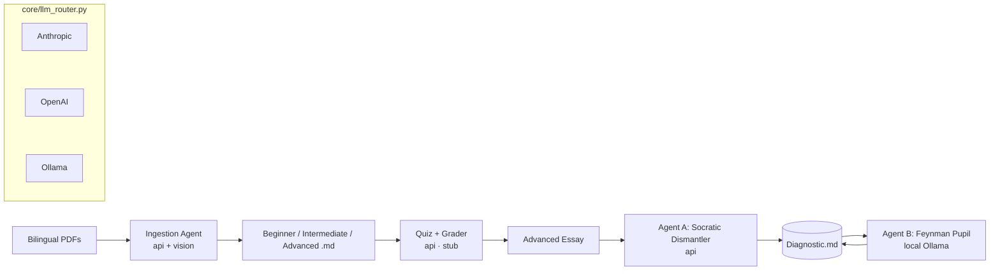

# 📚 Agentic Study System

A local, **hybrid multi-agent** study system that processes bilingual (English/Korean) course
material through three pedagogical phases — **Synthesis → Retention → Review** — and serves it all
from a browser. Organize work into **subjects**, each holding **weeks** that can bundle several
PDFs; act on weeks individually or in bulk. Cloud APIs do the heavy lifting; a local Ollama model
handles fast conversation. Every artifact is plain, portable Markdown.

> Pick a subject → drop lecture PDFs → bundle them into a week → get tiered notes → get your
> reasoning dismantled → teach it back to a curious novice until it's jargon-free.

---

## Table of contents
- [Why this exists](#why-this-exists)
- [Architecture](#architecture)
- [The five pedagogical invariants](#the-five-pedagogical-invariants)
- [Directory structure](#directory-structure)
- [Setup](#setup)
- [Usage — Web launcher](#usage--web-launcher)
- [Usage — CLI](#usage--cli)
- [Configuration (the routing table)](#configuration-the-routing-table)
- [How each phase works](#how-each-phase-works)
- [Extending the system](#extending-the-system)
- [Project status](#project-status)
- [Tech stack](#tech-stack)

---

## Why this exists

Most "AI tutors" hand you answers. This one is built around evidence-based learning science and
deliberately makes you do the cognitive work:

- It **separates** broad concepts from hardware specifics so you aren't overloaded.
- It **shows worked examples before rules**, draws **diagrams**, and keeps **Korean terminology**
  attached to every English term.
- It **never grades you "Correct/Incorrect."** Instead it traces *where* your mental model broke.
- It keeps an evolving **`Diagnostic.md`** of your strengths, weaknesses, and conceptual gaps.

---

## Architecture

A thin custom orchestrator (no heavy agent framework) wired around four ideas:

**1. Hybrid LLM router — one choke point, three backends.**
Every model call goes through `core/llm_router.py`. A single `chat()` signature dispatches to:

| Logical engine | Resolves to | Role | Agents |
|----------------|-------------|------|--------|
| `api` | Anthropic **or** OpenAI (set by `API_PROVIDER`) | **Heavy Lifter** — big context, EN↔KO translation, vision for slides | ingestion, socratic_dismantler, quiz, grader |
| `ollama` | local model (default `qwen2.5:7b`) | **Fast Chatter** — low-latency chat loops | feynman_pupil |

SDKs are imported lazily and errors are actionable (a missing key or a down Ollama server tells
you exactly what to fix). The router also supports **multimodal** messages — ingestion sends
rendered slide page-images alongside the text.

**2. File-based Markdown state as the message bus.**
Agents exchange **file paths and short summaries**, never raw essays or slide dumps, so the
orchestrator's context window stays small. Each subject's `Diagnostic.md` is the shared memory
between the review agents (one per subject, so learning state never bleeds across subjects).

**3. Deterministic rule enforcement.**
LLMs are non-deterministic, so the pedagogical rules are encoded **in code** (`core/validators.py`)
as pure `(ok, message)` checks. `BaseAgent.run_validated` runs the model, validates the output,
and **re-prompts with the concrete fix instructions** until the rules pass (bounded retries).

**4. Independent agents.**
Each agent subclasses `BaseAgent`, declares its engine/model in `config.yaml`, and loads a system
prompt from `prompts/`. Adding one is three small steps (see [Extending](#extending-the-system)).



---

## The five pedagogical invariants

Enforced by `core/validators.py` + the re-prompt loop — not left to chance.

| Rule | Meaning | Validator |
|------|---------|-----------|
| **Cognitive Load** | Broad concepts vs hardware specifics live in separate tier files. | tiering by design |
| **Dual Coding** | Every synthesis file contains a `mermaid` diagram. | `has_mermaid_block` |
| **Worked-Example Effect** | A solved step-by-step example precedes any abstract rule. | `worked_example_before_rules` |
| **Bilingual Integrity** | English output; the exact Korean term in parentheses right after the English term, e.g. `binary (이진법)`. | `korean_in_parentheses` |
| **Metacognitive Scaffolding** | Never "Correct/Incorrect" — trace where the mental model broke. | `no_binary_grading` |

---

## Directory structure

```
Agentic Study/
├── CLAUDE.md                  # persistent context for future agentic sessions
├── README.md                  # you are here
├── requirements.txt
├── .env.example               # API key / endpoint structure
├── config.yaml                # the deterministic routing table
├── main.py                    # CLI + `serve`
│
├── core/
│   ├── config.py              # loads .env + config.yaml, resolves api→provider/model
│   ├── llm_router.py          # hybrid router (anthropic | openai | ollama) + vision
│   ├── base_agent.py          # BaseAgent + run_validated re-prompt loop
│   ├── validators.py          # the five pedagogical rule checks
│   ├── pdf_parser.py          # bilingual PDF → text + rendered page PNGs (pymupdf)
│   ├── state.py               # Diagnostic.md read/append manager
│   └── library.py             # subjects + per-week status bookkeeping; inbox; migration
│
├── agents/
│   ├── ingestion_agent.py     # Phase 1 — tiered synthesis            (implemented)
│   ├── socratic_dismantler.py # Phase 3 Agent A — adversarial review  (implemented)
│   ├── feynman_pupil.py       # Phase 3 Agent B — teach-back chat      (implemented)
│   ├── quiz_agent.py          # Phase 2 — tiered quiz + interleaving  (implemented)
│   ├── grader_agent.py        # Phase 2 — traced feedback             (implemented)
│   └── web_explorer.py        # Phase 1 — Wikimedia Commons diagrams  (implemented)
│
├── prompts/                   # per-agent system prompts (rules encoded in prose)
│
├── webapp/
│   ├── server.py              # FastAPI: REST + /ws/feynman WebSocket
│   └── static/                # vanilla-JS dashboard (index.html, app.js, style.css)
│       └── vendor/            # marked.js + mermaid.js, vendored for offline use
│
├── study/inbox/                       # shared drop zone for new PDFs
└── curriculum/
    └── <subject-slug>/                # one subject (folder slug is stable across renames)
        ├── subject.json               # display name
        ├── Diagnostic.md              # this subject's strengths / weaknesses / gaps
        └── Week_NN/                   # input/, tier notes, assets/, Quiz/Essay/Critique
            └── meta.json              # optional week display title
```

> **Layout note:** weeks live under a subject (`curriculum/<slug>/Week_NN/`). An older flat
> `curriculum/Week_NN/` layout is migrated automatically on first launch into a default
> "Introduction to Computer Science" subject — idempotent and non-destructive.

---

## Setup

```bash
pip install -r requirements.txt
cp .env.example .env          # then set API_PROVIDER + the matching key
```

`.env` keys:

| Var | Purpose |
|-----|---------|
| `API_PROVIDER` | `anthropic` \| `openai` — which provider the `api` engine uses |
| `ANTHROPIC_API_KEY` | required if `API_PROVIDER=anthropic` |
| `OPENAI_API_KEY` | required if `API_PROVIDER=openai` |
| `OLLAMA_HOST` | Ollama endpoint (default `http://localhost:11434`) |

The local **Feynman Pupil** runs fully offline and needs **no API key** — just a running Ollama
(`ollama serve`) with the model named in `config.yaml` (default `qwen2.5:7b`). **Ingestion** and
**Socratic review** require an API key.

---

## Usage — Web launcher

```bash
python main.py serve          # → http://127.0.0.1:8000
```

1. **Pick a subject** in the top selector — or create one with **＋** (rename **✎** / delete **🗑**).
   Everything below is scoped to the active subject.
2. **Drop PDFs** onto the drop zone (or copy them into `study/inbox/`) — they appear in the shared
   **Inbox**.
3. **Bundle PDFs into a week:** check one or more inbox PDFs, choose a target (**→ New Week** or
   **→ Add to Week NN**), and click **Assign**. Several PDFs can share one week; adding more and
   re-ingesting folds them in.
4. **Per-week actions:** **Ingest** (tiered notes) · **Quiz** (take/answer/grade in the Quiz tab) ·
   **Review** (Socratic critique) · **Feynman** (live teach-back chat). Status badges track
   progress: **New → Ingested → Quizzed → Reviewed**.
5. **Bulk actions:** tick week checkboxes (or **All**) and run **Ingest / Quiz / Review** across the
   selection at once — ineligible weeks are skipped, not errored.
6. **Edit a week:** the **Edit** button reveals rename, per-PDF **move** (to another week or back to
   inbox) / **delete**, **merge into** another week, and **delete week**.
7. Click any generated file chip to read it — **Mermaid diagrams render inline**.

Long LLM calls run in a worker thread so the UI stays responsive; the Feynman chat streams over a
WebSocket. The frontend has **no build step and no network dependency** (marked + mermaid are
vendored).

---

## Usage — CLI

Same agents, no browser. Week commands take `--subject SLUG|NAME` (default: the first subject):

```bash
python main.py ingest  --week 1                       # Phase 1: PDFs → tiered notes
python main.py explore --week 1                       # Phase 1: fetch reference diagrams (Commons)
python main.py quiz    --week 1                       # Phase 2: build quiz + answers template
python main.py grade   --week 1                       # Phase 2: trace-grade your answers
python main.py review  --week 1 [--subject "Intro to CS"]   # Phase 3 Agent A (essay auto-located)
python main.py feynman --week 1 [--model qwen3:30b]   # Phase 3 Agent B  (/done to end)
python main.py serve   [--port 8000]                  # web launcher
```

A sample Week 01 `Essay.md` ships under the default subject so `review` works out of the box.

---

## Configuration (the routing table)

`config.yaml` is the single source of truth for which model each agent uses. Change behavior
without touching code:

```yaml
api_models:                 # default model per provider when an agent says model: auto
  anthropic: claude-opus-4-7
  openai: gpt-4o

agents:
  ingestion:
    engine: api
    model: auto
    temperature: 0.3
    max_images: 10          # cap slide page-images sent per tier (cost control)
  socratic_dismantler:
    engine: api
    model: auto
    temperature: 0.4
  feynman_pupil:
    engine: ollama
    model: qwen2.5:7b       # swap to qwen3:30b for a tougher pupil
    temperature: 0.7

validation:
  max_retries: 2            # bounded re-prompt loop for rule enforcement
```

---

## How each phase works

**Phase 1 — Knowledge Synthesis** (`agents/ingestion_agent.py`)
Parses each week's PDFs into text **and** rendered page images (`core/pdf_parser.py`), then asks
the vision API to produce three tier files (`Beginner.md`, `Intermediate.md`, `Advanced.md`).
Each tier is held to the synthesis rules (worked-example-first, a Mermaid diagram, Korean terms in
parentheses, tier-appropriate depth) via the re-prompt loop. The **Web Explorer**
(`agents/web_explorer.py`) optionally enriches a week: it derives diagram queries from the notes
and pulls CC-licensed images from **Wikimedia Commons** into `assets/`, writing a `Diagrams.md`
with captions, license, and source links (best-effort — Mermaid still covers Dual Coding offline).

**Phase 2 — Retention** (`agents/quiz_agent.py`, `grader_agent.py`)
The **Quiz Agent** generates a tiered quiz from the Phase 1 notes (Beginner: MCQ/cloze/definitions
→ Intermediate: application/logic → Advanced: a synthesis essay prompt), with an **Interleaved
Review** section drawing ~20% of questions from prior weeks (deterministically enforced by
`require_interleaving`). One call also produces a blank `Answers.md` template. The **Grader Agent**
("Diagnostic Coach") reads your answers and writes `Feedback.md` — tracing where your reasoning
diverges rather than scoring it (`no_binary_grading`), and appending findings to `Diagnostic.md`.
In the web UI this is the **Quiz** tab: take the quiz, type answers, "Submit for grading", and
write your Advanced essay (saved to `Essay.md` for Phase 3 Review).

**Phase 3 — Review**
- **Agent A — Socratic Dismantler** (`socratic_dismantler.py`, API): ingests the Advanced essay,
  attacks causal links, finds logical leaps, demands edge cases, writes `Critique.md`, and appends
  every flaw to `Diagnostic.md`. Never grades.
- **Agent B — Feynman Pupil** (`feynman_pupil.py`, local Ollama): reads `Diagnostic.md`, plays a
  curious novice, and forces you to teach concepts back — asking "Why?" and poking holes until the
  explanation is jargon-free. Appends a session summary.

---

## Extending the system

- **New agent** → add an entry to `config.yaml`, subclass `BaseAgent`, drop a system prompt in
  `prompts/`.
- **New pedagogical rule** → add a `Validator` to `core/validators.py` and include it in the
  agent's bundle.
- **New backend** → extend `LLMRouter.chat`, keeping the uniform
  `(messages, engine, model, system, temperature)` signature.

---

## Project status

| Area | State |
|------|-------|
| Phase 1 Ingestion (tiered synthesis, vision) | ✅ implemented |
| Phase 2 Quiz / Grader (tiered, 20% interleaving, traced feedback) | ✅ implemented |
| Phase 3 Review (Socratic Dismantler + Feynman Pupil) | ✅ implemented |
| Web launcher (FastAPI + dashboard + Quiz tab + live chat) | ✅ implemented |
| Subjects (nested layout, per-subject Diagnostic, picker + CRUD, auto-migration) | ✅ implemented |
| Multi-PDF weeks (bundle several PDFs into one week) | ✅ implemented |
| Bulk week actions (select weeks → Ingest / Quiz / Review all) | ✅ implemented |
| Modify weeks (rename · move/delete PDFs · merge · delete week) | ✅ implemented |
| Hybrid router (Anthropic / OpenAI / Ollama, multimodal) | ✅ implemented |
| Deterministic validators + re-prompt loop | ✅ implemented |
| Web image search for diagrams (Wikimedia Commons → `Diagrams.md`) | ✅ implemented |

---

## Tech stack

Python 3.13 · FastAPI + Uvicorn · pymupdf · Anthropic / OpenAI SDKs · Ollama · marked.js +
mermaid.js (vendored). No frontend build step.

---

## License

Released under the [MIT License](LICENSE).
