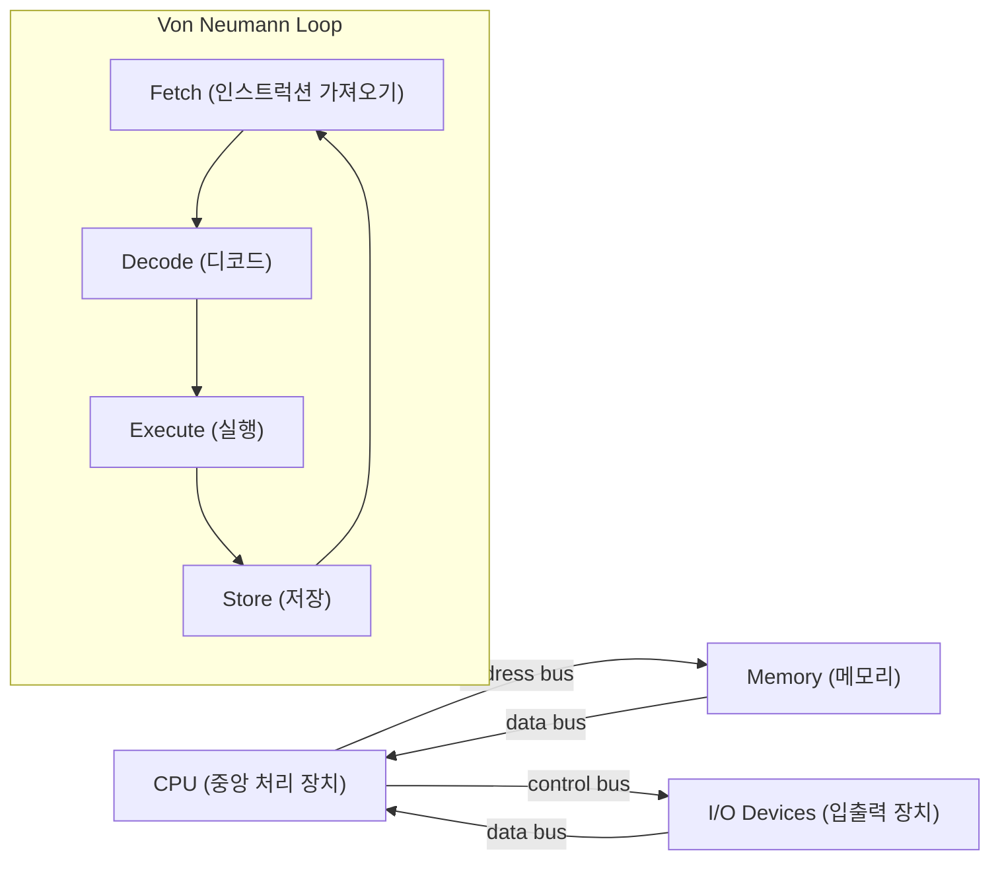
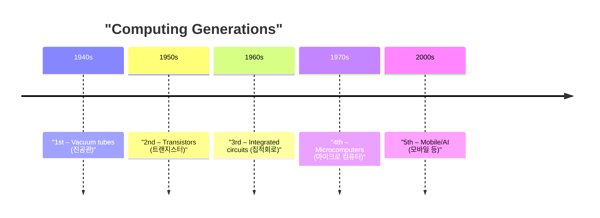
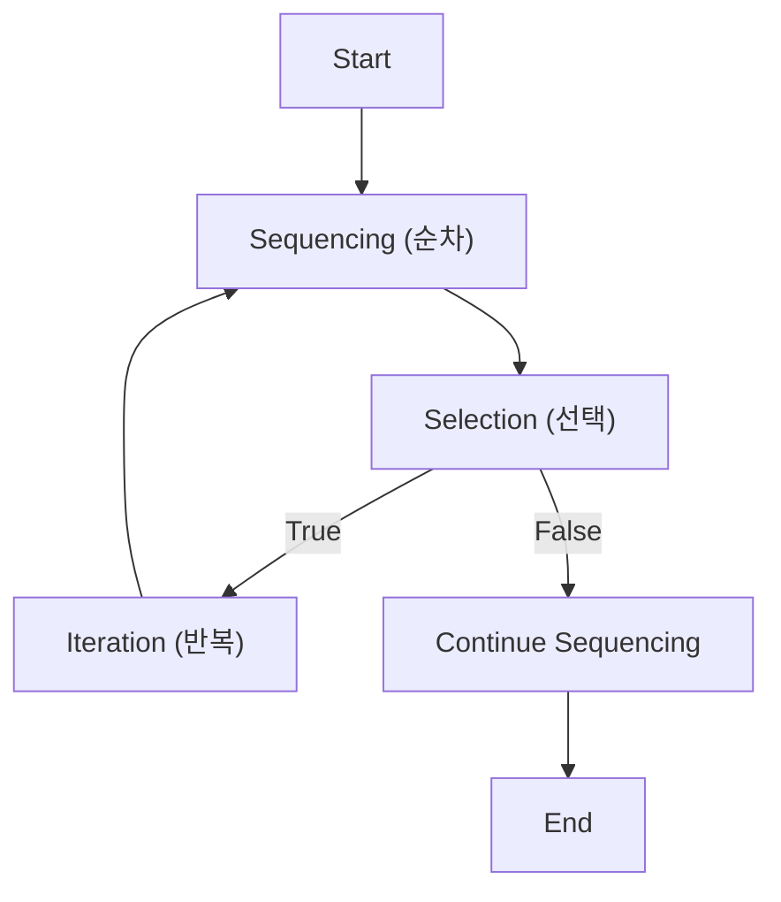
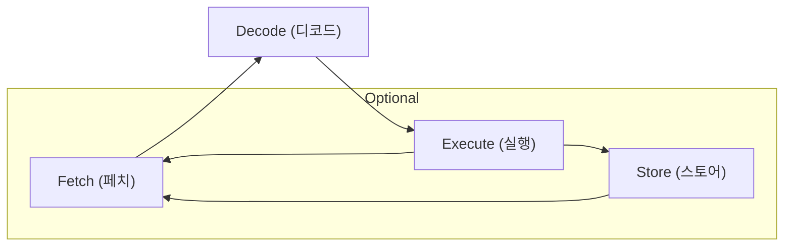

# Advanced — Computer Science Foundations (컴퓨터과학 기초)

> This tier dives into the hardware‑level mechanics and formal structure behind the fundamental concepts introduced in the first lecture: problem discovery (문제 발견), algorithmic reasoning, binary number (이진수) representation, and the evolution of computing hardware up to the modern stored‑program computer (내장 프로그램 컴퓨터).

## Worked Example (풀이 예제)

**Problem:**  
Convert the decimal integer **156** to binary (이진수) and then describe, step‑by‑step, how a stored‑program computer (내장 프로그램 컴퓨터) would execute a simple algorithm that adds **1** to this number using only the three primitive algorithmic constructs: sequence (순차), condition (조건), and iteration (반복).

### Step 1 – Decimal‑to‑Binary Conversion  

| Division step | Quotient | Remainder (binary digit) |
|---------------|----------|--------------------------|
| 156 ÷ 2 = 78  | 78       | 0 |
| 78 ÷ 2 = 39   | 39       | 0 |
| 39 ÷ 2 = 19   | 19       | 1 |
| 19 ÷ 2 = 9    | 9        | 1 |
| 9 ÷ 2 = 4     | 4        | 1 |
| 4 ÷ 2 = 2     | 2        | 0 |
| 2 ÷ 2 = 1     | 1        | 0 |
| 1 ÷ 2 = 0     | 0        | 1 |

Reading the remainders **bottom‑up** yields **10011100₂**.

### Step 2 – Define the “add‑one” algorithm using primitive constructs  

```text
1.  // sequence (순차): load the binary number into a register R
2.  R ← 10011100₂
3.  // iteration (반복): start from the least‑significant bit (LSB) and propagate carry
4.  i ← 0                     // i = bit index
5.  carry ← 1                // we are adding 1
6.  while (i < 8) {          // 8‑bit word
7.      bit ← R[i]           // read ith bit
8.      sum ← bit + carry
9.      R[i] ← sum mod 2     // condition (조건): write back result bit
10.     carry ← sum / 2      // condition (조건): new carry (0 or 1)
11.     i ← i + 1            // sequence (순차): move to next bit
12.     if (carry = 0) break // condition (조건): early exit if no carry
13. }
14. // sequence (순차): final result is now in R
```

### Step 3 – How a stored‑program computer executes the algorithm  

1. **Fetch** the next instruction from memory (address (주소)) using the program counter (PC).  
2. **Decode** the instruction in the instruction register (instruction (인스트럭션) register).  
3. **Execute** the micro‑operations (e.g., register transfer, ALU addition).  
4. **Store** any results back to registers or memory.  
5. Increment PC → **machine cycle (기계 주기)** repeats until a halt instruction.

During the loop (lines 6‑13) the CPU repeatedly performs the fetch‑decode‑execute cycle, updating the register `R` and the `carry` flag. When `carry` becomes 0, the conditional branch (`if`) causes the PC to jump to line 14, ending the loop.

**Result:** `R` now holds **10011101₂**, which is **157₁₀** – the original number plus one.

---

## Core Ideas

### 1. Problem discovery (문제 발견) & solution search (해결 방법 찾기)  
- **Problem discovery** is the systematic identification of a computational need or question.  
- **Solution search** involves enumerating possible approaches, then selecting an efficient one via algorithmic analysis.

### 2. Algorithmic problem solving (알고리즘식 문제해결 방법)  
An **algorithm (알고리즘)** is a finite, ordered set of instructions that transforms input data into desired output. In the advanced view, an algorithm is realized as a sequence of **machine cycles (기계 주기)** that manipulate bits stored in **memory (메모리)**.

#### Primitive Constructs  

| Construct | Korean | Role in hardware execution |
|-----------|--------|----------------------------|
| Sequence  | 순차   | Linear progression of instruction addresses (PC increments). |
| Condition | 조건   | Branch instructions that modify PC based on flag registers (e.g., zero, carry). |
| Iteration | 반복   | Looping realized by conditional branches that cause the PC to jump backward. |

### 3. Information processing (정보처리) & binary number (이진수)  
- All data inside a computer is represented as **binary digits (bits)**, the base‑2 numeral system.  
- Binary arithmetic is performed by the **arithmetic‑logic unit (ALU)** using logic gates (AND, OR, XOR, NOT).  
- Example: Adding two bits `a` and `b` with a carry‑in `c_in` yields `sum = a ⊕ b ⊕ c_in` and `c_out = (a·b) + (c_in·(a⊕b))`.

### 4. von Neumann architecture (폰노이만) & stored‑program concept (내장 프로그램 컴퓨터)  
- The **von Neumann (폰노이만) architecture** stores both data and instructions in the same **memory (메모리)** address space, enabling the **stored‑program** paradigm.  
- A single **bus** transfers **addresses**, **data**, and **control signals** between **CPU**, **memory**, and **I/O** devices.  
- The **machine cycle (기계 주기)** consists of **fetch → decode → execute → store** phases, repeated for each instruction.



### 5. Generations of computing (컴퓨팅 세대)  

| Generation | Korean | Dominant Technology | Representative Hardware |
|------------|--------|----------------------|--------------------------|
| First generation computing | 제1세대 컴퓨팅 | **vacuum tube (진공관)** as switches; large, high power. |
| Second generation computing | 제2세대 컴퓨팅 | **transistor (트랜지스터)** replace tubes; smaller, faster, lower power. |
| Third generation computing | 제3세대 컴퓨팅 | **integrated circuit (집적회로)** pack thousands of transistors on a chip. |
| Fourth generation computing | 제4세대 컴퓨팅 | **microcomputer (마이크로 컴퓨터)** integrate CPU on a single IC; personal computers. |
| Fifth generation computing | 제5세대 컴퓨팅 | **mobile and embedded systems (모바일 등)**; system‑on‑chip, AI accelerators. |



### 6. Core hardware elements  

- **Program (프로그램):** A sequence of binary‑encoded instructions residing in memory (메모리).  
- **Memory (메모리):** Organized as an array of addressable **words**; each word holds a fixed number of bits.  
- **Instruction (인스트럭션):** Binary pattern that tells the CPU which operation to perform and on which operands.  
- **Machine cycle (기계 주기):** The clock‑driven rhythm that synchronizes fetch, decode, execute, and store phases.  
- **Address (주소):** Binary identifier used by the CPU to locate a word in memory; often supplied by the **program counter (PC)** during sequential execution or by branch logic during conditional jumps.

---

## Key Terms (핵심 용어)

- **Computer science (컴퓨터과학)** — systematic study of algorithms, data structures, and hardware/software systems.  
- **Problem discovery (문제 발견)** — process of identifying a computational task that needs solving.  
- **Solution search (해결 방법 찾기)** — exploring possible algorithms or heuristics to address a problem.  
- **Algorithmic problem solving (알고리즘식 문제해결 방법)** — using algorithms (알고리즘) to transform inputs into outputs.  
- **Algorithm (알고리즘)** — finite, well‑defined sequence of operations.  
- **Sequence (순차)** — linear ordering of instructions; PC increments by one each cycle.  
- **Condition (조건)** — Boolean test that determines control‑flow branching.  
- **Iteration (반복)** — repeated execution of a block via conditional jumps.  
- **Information processing (정보처리)** — manipulation of binary data by logical and arithmetic circuits.  
- **Binary number (이진수)** — base‑2 numeral system using digits 0 and 1.  
- **von Neumann (폰노이만)** — architecture where program and data share the same memory space.  
- **Stored‑program computer (내장 프로그램 컴퓨터)** — machine that reads its own instructions from memory.  
- **Vacuum tube (진공관)** — early electronic switch, high power, large size.  
- **Transistor (트랜지스터)** — semiconductor switch, faster and more reliable than tubes.  
- **Integrated circuit (집적회로)** — chip containing many transistors and passive components.  
- **Microcomputer (마이크로 컴퓨터)** — personal computer built around a microprocessor.  
- **Mobile and embedded systems (모바일 등)** — modern computing devices (smartphones, tablets) with system‑on‑chip designs.  
- **Program (프로그램)** — binary‑encoded instruction set stored in memory (메모리).  
- **Memory (메모리)** — addressable storage for data and instructions.  
- **Instruction (인스트럭션)** — binary code specifying an operation for the CPU.  
- **Machine cycle (기계 주기)** — fundamental clock‑driven step: fetch, decode, execute, store.  
- **Address (주소)** — binary location identifier used to access memory cells.

---

## Self-Check Prompts

1. Explain how the three primitive algorithmic constructs (sequence (순차), condition (조건), iteration (반복)) map onto the hardware actions of the program counter and branch logic.  
2. Convert the decimal number 156 to binary (이진수) and trace each machine cycle (기계 주기) the CPU would perform to execute the “add‑one” algorithm shown in the worked example.  
3. Compare the first and fourth generations of computing in terms of switching technology, typical word size, and power consumption.  
4. Describe why the von Neumann (폰노이만) architecture enables the stored‑program concept (내장 프로그램 컴퓨터), and identify one major limitation that arises from sharing a single memory for code and data.

---

# Advanced — Foundations of Computing (컴퓨팅 기초)

> This tier delves into the hardware‑level mechanics and formal properties of algorithms, programs, and the CPU’s machine cycle.

## Worked Example (풀이 예제)

**Problem:**  
Write an algorithm that computes the factorial of a non‑negative integer *n* ( *n!* ). Show how the algorithm satisfies the formal properties of an algorithm, identify its control‑structure components (sequencing, selection, iteration), and trace one iteration of the CPU’s machine cycle (fetch → decode → execute) for the first instruction.

**Step‑by‑step solution**

1. **Define the problem formally**  
   Input: integer *n* ≥ 0  
   Output: integer *f* = *n!* = 1·2·…·*n* (with 0! = 1)

2. **Design the algorithm** (pseudocode)

   ```
   1  READ n                         // input
   2  IF n < 0 THEN                  // selection
   3      PRINT "error"
   4      STOP
   5  ENDIF
   6  f ← 1                           // initialization (sequencing)
   7  i ← 2
   8  WHILE i ≤ n DO                  // iteration
   9      f ← f * i
 10      i ← i + 1
 11  ENDWHILE
 12  PRINT f                         // output
   ```

3. **Check algorithmic properties**

   * **Finiteness (유한성)** – The loop (lines 8‑10) executes at most *n‑1* times; the whole procedure ends after line 12.  
   * **Definiteness (명확성)** – Every statement is precisely specified: the condition `i ≤ n` is a Boolean expression; the assignment `f ← f * i` is a single, unambiguous operation.  
   * **Effective computability (효과적 계산 가능성)** – Each step consists of elementary arithmetic or control operations that a processor can execute directly.

4. **Identify control‑structure components**

   * **Sequencing (순차)** – Lines 1‑6 occur in a fixed order.  
   * **Selection (선택)** – Lines 2‑5 decide whether to abort based on the sign of *n*.  
   * **Iteration (반복)** – Lines 8‑10 repeat until the loop condition fails.

5. **Map the first instruction to the machine cycle**

   *First instruction*: `READ n` (typically compiled to a machine‑level “input” opcode).

   | Phase | What the CPU does (hardware view) |
   |------|-----------------------------------|
   | **Fetch (페치)** | The **control unit** uses the **program counter** (프로그램 카운터) to address main **memory** (메모리) and loads the binary opcode for `READ n` into the **instruction register** (명령 레지스터). |
   | **Decode (디코드)** | The **instruction decoder** interprets the opcode, determines that the operation is an input request, and identifies any operand fields (e.g., the memory address where *n* will be stored). |
   | **Execute (실행)** | The **ALU** or I/O subsystem performs the input operation, placing the entered value into the designated register or memory location; the **program counter** increments to point to the next instruction. |

   After execution, the CPU automatically returns to the **fetch** phase for the next instruction (`IF n < 0 THEN`).

---

## Core Ideas

### 1. Computer Science (컴퓨터 과학) as a Discipline
- Studies **computers and computing**: theoretical foundations (algorithms, data structures), hardware, software, and information processing.
- Encompasses **algorithm design**, **network architecture**, **data modeling**, and **artificial intelligence**.
- Distinguished from mere **computer programming**; it is an academic research field.

### 2. Problem‑Solving Techniques (문제 해결 기법)
- Applied across domains: philosophy, medicine, engineering, etc.
- **Process flow**:  
  1. **Problem finding & shaping** – discover and simplify the issue.  
  2. **Generate & evaluate solutions** – brainstorm alternatives, assess feasibility.  
  3. **Select, implement, verify** – choose a solution, execute it, and test correctness.  
- Success depends on **problem orientation** (coping style/skills) and **systematic analysis**.

### 3. Algorithms (알고리즘)
- A **finite sequence of well‑defined instructions** that solves a class of problems or performs a computation.
- **Essential properties**  
  - **Finity (유한성)** – guaranteed termination after a bounded number of steps.  
  - **Definiteness (명확성)** – each step is precisely described.  
  - **Effective computability (효과적 계산 가능성)** – steps are executable by a real machine.
- **Control structures**  
  - **Sequencing (순차)** – linear ordering of steps.  
  - **Selection (선택)** – conditional branching based on a Boolean expression.  
  - **Iteration (반복)** – repeated execution (loops) until a condition holds.



### 4. Programs (프로그램)
- A **detailed, unambiguous plan** for solving a problem with a computer; essentially a concrete implementation of an algorithm.
- Stored in **memory** (primary memory) and fetched by the CPU for execution.
- Historical note: the concept of an **internally stored program** was introduced by **John von Neumann** in the late 1940s.

### 5. Memory (메모리) and Instructions (명령)
- **Memory** holds data and **instructions** that the CPU needs; it supplies the **CPU** (central processing unit) with the next operation.
- An **instruction** is a single operation defined by the processor’s **instruction set architecture (ISA)**; it tells the CPU *what* to do.

### 6. Machine Cycle (기계 사이클)
- The **basic CPU operation** performed for each instruction: **fetch → decode → execute** (and optionally **store**).
- **Fetch**: Control unit reads the instruction from memory using the **program counter**.  
- **Decode**: Instruction register holds the opcode; decoder splits operand fields.  
- **Execute**: The CPU carries out the operation (ALU computation, memory access, I/O).  
- Modern CPUs repeat this cycle millions of times per second, enabling rapid program execution.



---

## Key Terms (핵심 용어)

- **Computer science (컴퓨터 과학)** — study of computation, algorithms, hardware, software, and information processing.  
- **Algorithm (알고리즘)** — finite, well‑defined instruction sequence solving a problem.  
- **Finity (유한성)** — guarantee that an algorithm terminates after a limited number of steps.  
- **Definiteness (명확성)** — each step is precisely specified without ambiguity.  
- **Effective computability (효과적 계산 가능성)** — steps can be carried out by a real computer.  
- **Sequencing (순차)** — linear ordering of algorithmic steps.  
- **Selection (선택)** — conditional branching based on a Boolean test.  
- **Iteration (반복)** — repeated execution of a step block until a condition is met.  
- **Program (프로그램)** — concrete, ordered set of machine‑level instructions implementing an algorithm.  
- **Memory (메모리)** — primary storage that holds data and instructions for the CPU.  
- **Instruction (명령)** — single operation defined by the processor’s instruction set.  
- **Machine cycle (기계 사이클)** — the fetch‑decode‑execute (and optional store) loop performed for each instruction.  
- **Fetch (페치)** — retrieving the next instruction from memory using the program counter.  
- **Decode (디코드)** — interpreting the fetched opcode and extracting operands.  
- **Execute (실행)** — performing the operation specified by the decoded instruction.  
- **Program counter (프로그램 카운터)** — register that points to the address of the next instruction to fetch.  
- **Instruction register (명령 레지스터)** — holds the currently fetched instruction for decoding and execution.

---

## Self-Check Prompts

1. **Explain** why an algorithm must satisfy finiteness, definiteness, and effective computability, and give a concrete example where one property fails.  
2. **Identify** the three control‑structure categories (sequencing, selection, iteration) in a given pseudocode snippet.  
3. **Describe** each phase of the machine cycle and illustrate how the program counter and instruction register are used during fetch and decode.  
4. **Differentiate** between “computer science” and “computer programming” in terms of scope and research focus.
