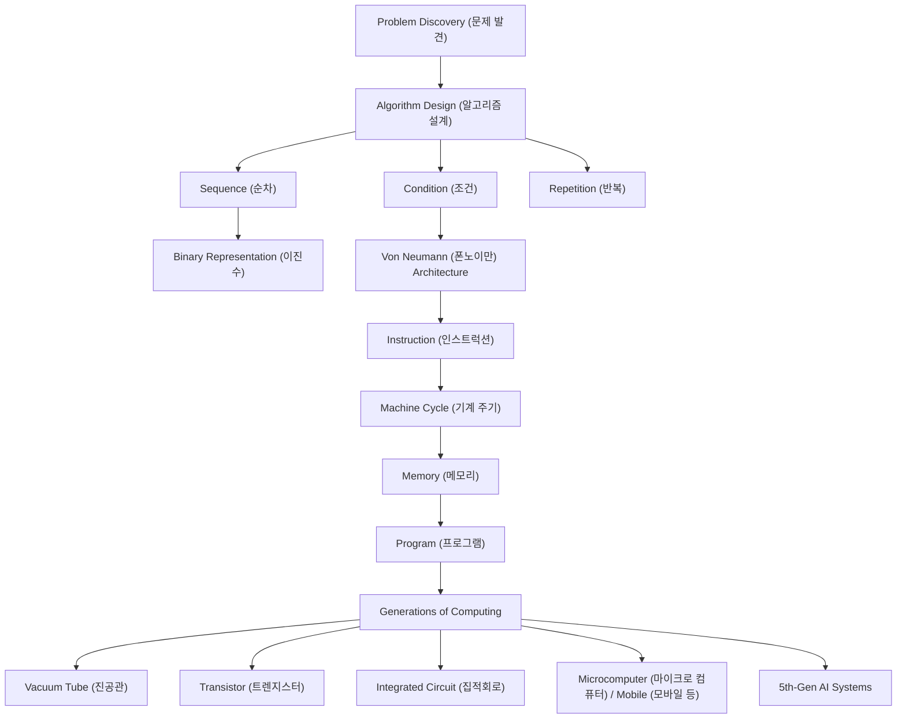
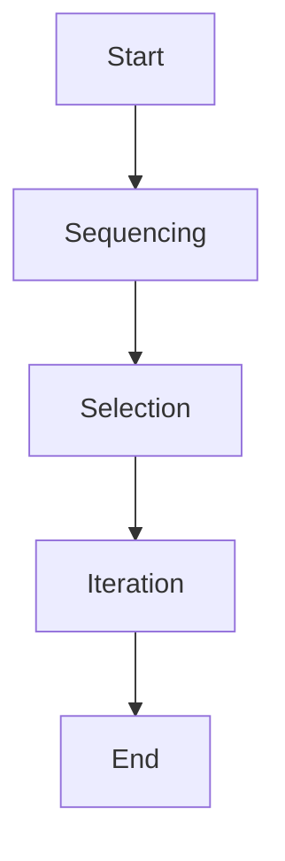

# Beginner — Computer Science Overview (컴퓨터과학 개요)

> This tier introduces the big‑picture ideas of computer science: how we turn problems into step‑by‑step solutions (algorithms), how computers represent data (binary), and how hardware has evolved from vacuum tubes to mobile devices.

## Worked Example (풀이 예제)

**Problem:**  
Given three integers `a`, `b`, and `c`, determine the largest value.

**Step‑by‑step solution using the basic algorithmic constructs — condition (조건), repetition (반복), and sequence (순차).**

1. **Start (순차)** – Begin the algorithm.  
2. **Initialize** a variable `max` with the value of `a`.  
   - `max ← a`  
3. **Condition (조건) 1:** Is `b` greater than `max`?  
   - If **yes**, set `max ← b`.  
   - If **no**, do nothing.  
4. **Condition (조건) 2:** Is `c` greater than `max`?  
   - If **yes**, set `max ← c`.  
   - If **no**, do nothing.  
5. **End (순차)** – Output `max` as the largest number.

**Explanation of each construct**

| Construct | What we did in the example |
|-----------|----------------------------|
| **Sequence (순차)** | Steps 1 → 2 → 3 → 4 → 5 happen one after another. |
| **Condition (조건)** | Steps 3 and 4 each ask a yes/no question and choose a path. |
| **Repetition (반복)** | Not needed for this particular problem, but if we had an unknown number of inputs we could loop over them. |

**Result:**  
If `a = 7`, `b = 12`, `c = 5`, the algorithm outputs `12`.

---

## Core Ideas

### 1. Problem Discovery (문제 발견) & Solution Search (해결 방법 찾기)
- **Problem discovery** is the act of noticing a question or task that needs a systematic answer (e.g., “Which of these numbers is biggest?”).  
- **Solution search** means looking for a reliable, repeatable method—an **algorithm (알고리즘)**—to solve the problem.

### 2. Algorithms (알고리즘) as Structured Instructions
- An algorithm is a finite, ordered list of **instructions (인스트럭션)** that a computer can follow.
- Three fundamental control structures appear in almost every algorithm:
  1. **Sequence (순차)** – Do things one after another.  
  2. **Condition (조건)** – Choose between alternatives based on a test (if‑else).  
  3. **Repetition (반복)** – Perform a set of steps many times (loops).

### 3. Information Processing (정보처리) & Binary Numbers (이진수)
- Computers manipulate data using the **binary number system (이진수)**, which uses only two symbols: 0 and 1.
- Binary is natural for electronic hardware because a voltage can be “off” (0) or “on” (1).

### 4. The Von Neumann Architecture (폰노이만)
- Named after John von Neumann, this design stores both **programs (프로그램)** and **data (데이터)** in the same **memory (메모리)**.  
- The **machine cycle (기계 주기)** repeatedly fetches an **instruction (인스트럭션)** from memory, decodes it, executes it, and then moves to the next address.

### 5. Generations of Computing (컴퓨팅 세대)
| Generation | Typical Hardware | Key Innovation |
|------------|------------------|----------------|
| **1st (제1세대)** | **Vacuum tubes (진공관)** | First electronic switches, large and power‑hungry. |
| **2nd (제2세대)** | **Transistors (트렌지스터)** | Smaller, more reliable, lower power. |
| **3rd (제3세대)** | **Integrated circuits (집적회로)** | Hundreds to millions of transistors on a single chip. |
| **4th (제4세대)** | **Microcomputers (마이크로 컴퓨터)**, later **mobile devices (모바일 등)** | Entire computers on a single chip (CPU, memory, I/O). |
| **5th (제5세대)** | **Artificial intelligence‑oriented systems** (still emerging) | Emphasis on parallelism, knowledge processing, and natural language. |

- Each generation builds on the previous one, making computers **smaller**, **faster**, and **more capable**.

### 6. From Built‑in Programs to Modern Software
- Early machines had **built‑in programs (내장 프로그램)** hard‑wired into hardware.  
- Modern computers load **software**—collections of instructions—into memory, allowing the same hardware to run many different tasks.

---



---

## Key Terms (핵심 용어)

- **Algorithm (알고리즘)** — A precise, step‑by‑step procedure for solving a problem.  
- **Condition (조건)** — A test that decides which path an algorithm follows (if/else).  
- **Repetition (반복)** — Re‑executing a set of steps multiple times (loops).  
- **Sequence (순차)** — Executing steps one after another in a fixed order.  
- **Binary number (이진수)** — Number system using only 0 and 1; the native language of digital computers.  
- **Von Neumann (폰노이만) architecture** — Computer design where program and data share the same memory space.  
- **Instruction (인스트럭션)** — A single operation that the CPU can execute (e.g., add, load).  
- **Machine cycle (기계 주기)** — The repeatable process of fetching, decoding, and executing an instruction.  
- **Memory (메모리)** — Storage that holds data and programs while the computer runs.  
- **Program (프로그램)** — A collection of instructions that tells the computer what to do.  
- **Vacuum tube (진공관)** — Early electronic switch used in 1st‑generation computers.  
- **Transistor (트렌지스터)** — Solid‑state switch that replaced vacuum tubes in 2nd‑generation computers.  
- **Integrated circuit (집적회로)** — A chip containing many transistors, enabling 3rd‑generation computers.  
- **Microcomputer (마이크로 컴퓨터)** — A complete computer on a single chip, typical of the 4th generation.  
- **Mobile (모바일 등)** — Portable devices (smartphones, tablets) that evolved from microcomputers.  

---

## Self-Check Prompts

1. What are the three basic control structures of an algorithm, and how does each appear in the “largest of three numbers” example?  
2. Why do computers use binary numbers instead of decimal numbers?  
3. Describe the key difference between the 1st‑generation (vacuum tube) and 2nd‑generation (transistor) computers.  
4. In the Von Neumann model, what role does memory play during the machine cycle?

---

# Beginner — Computer Science Overview (컴퓨터 과학 개요)

> This tier introduces what computer science studies, how problems are tackled, and the basic building blocks that let a computer turn ideas into actions.

## Worked Example (풀이 예제)

**Problem:** Write a simple algorithm that decides whether a given integer `n` is even or odd, and then describe how the computer carries out this algorithm step‑by‑step.

### Step 1 – Problem Finding & Shaping  
- **Goal:** Determine the parity (even‑ness) of a single integer.  
- **Simplify:** The input is one whole number; the output is the word “even” or “odd”.

### Step 2 – Generate Possible Solutions  
1. **Division‑remainder method:** Compute `n % 2` (the remainder after division by 2).  
2. **Bit‑mask method:** Check the least‑significant bit of `n`.  

### Step 3 – Evaluate & Select a Solution  
- The division‑remainder method is easy to understand and works for any integer, so we select it.

### Step 4 – Write the Algorithm (Sequencing)  

| Step | Action (English (Korean)) |
|------|---------------------------|
| 1 | **Read** the integer `n` (읽다) |
| 2 | **Compute** `r = n % 2` (계산하다) |
| 3 | **If** `r == 0` (조건) **then** output “even” (출력) |
| 4 | **Else** output “odd” (출력) |

### Step 5 – Implement (Program)  
```pseudo
read n
r = n % 2
if r == 0 then
    print "even"
else
    print "odd"
```

### Step 6 – Verify (Machine Cycle)  

1. **Fetch** the first instruction (`read n`) from memory.  
2. **Decode** it → the CPU knows it must read from the input device.  
3. **Execute** → the value of `n` is stored in a register.  

The cycle repeats for each subsequent instruction (`%`, `if`, `print`). When the program finishes, the correct word (“even” or “odd”) appears on the screen, confirming the algorithm works.

---

## Core Ideas

### 1. What Is Computer Science? (컴퓨터 과학)  
Computer science is the study of computers and computing. It covers **theoretical foundations** (algorithms, data structures), **hardware and software**, and **applications** such as data processing and artificial intelligence. Unlike pure programming, it is an academic discipline that investigates *why* and *how* computing works.

### 2. Problem‑Solving Techniques (문제 해결)  
- Used across many fields (philosophy, medicine, engineering, etc.).  
- **Process:**  
  1. **Problem finding & shaping** – discover the issue and simplify it.  
  2. **Generate & evaluate solutions** – brainstorm possible ways to solve it.  
  3. **Select, implement & verify** – choose the best solution, apply it, and check the result.  
- Success depends on **problem orientation** (the solver’s style and skills) and systematic analysis.

### 3. Algorithms (알고리즘)

#### Definition  
An algorithm is a **finite sequence of well‑defined instructions** that solves a class of problems or performs a computation.

#### Core Properties  
- **Finineness (유한성)** – the process ends after a limited number of steps.  
- **Definiteness (명확성)** – each step is precisely described.  
- **Effective computability (효과적 계산 가능성)** – every step can be carried out by a computer.

#### Control Structures  
| Structure | What It Does | Example |
|-----------|--------------|---------|
| **Sequencing** (순서화) | Executes steps in a specific order. | Read → Compute → Print |
| **Selection** (선택) | Chooses different steps based on a Boolean condition. | `if r == 0 then … else …` |
| **Iteration** (반복) | Repeats a set of steps until a condition is met. | Loop through an array to find a maximum |



### 4. Programs (프로그램)  
A program is an **unambiguous, ordered sequence of computational instructions** that tells a computer how to solve a problem. Programs reside in memory and can be run continuously or intermittently. The stored‑program concept was introduced by **John von Neumann** in the late 1940s.

### 5. Memory (메모리)  
Memory is the area where a computer **stores data and instructions**. It supplies the CPU with the next instruction to execute. Types include **primary memory** (RAM) and various caches, each playing a role in overall system performance.

### 6. Instructions (명령어)  
An instruction is a single operation defined by the processor’s **instruction set**. It is the basic command a program gives to the CPU (e.g., “add two numbers”, “jump to address X”).

### 7. Machine Cycle (기계 사이클)  
The machine cycle is the repeating set of steps the CPU performs for each instruction:

1. **Fetch (페치)** – The control unit requests the next instruction from memory, using the **program counter**.  
2. **Decode (디코드)** – The instruction is placed in the **instruction register** and broken into opcode and operands.  
3. **Execute (실행)** – The CPU carries out the operation indicated by the opcode.  
4. *(Optional)* **Store** – Result may be written back to memory.


---

## Key Terms (핵심 용어)

- **Computer science (컴퓨터 과학)** – The academic study of computing, covering theory, hardware, software, and applications.  
- **Problem solving (문제 해결)** – A systematic process of identifying, shaping, and addressing challenges.  
- **Algorithm (알고리즘)** – A finite, well‑defined step‑by‑step procedure to solve a problem.  
- **Finineness (유한성)** – The guarantee that an algorithm finishes after a limited number of steps.  
- **Definiteness (명확성)** – Each step of an algorithm is precisely specified.  
- **Effective computability (효과적 계산 가능성)** – Every step can be performed by a computer.  
- **Sequencing (순서화)** – Executing steps in a specific order.  
- **Selection (선택)** – Branching based on a condition.  
- **Iteration (반복)** – Repeating steps until a condition holds.  
- **Program (프로그램)** – An ordered set of instructions that a computer can execute.  
- **Memory (메모리)** – Storage area for data and instructions, often called primary memory.  
- **Instruction (명령어)** – A single operation defined by the processor’s instruction set.  
- **Machine cycle (기계 사이클)** – The repeatable fetch‑decode‑execute (and optional store) process of the CPU.  
- **Fetch (페치)** – Retrieving the next instruction from memory.  
- **Decode (디코드)** – Interpreting the fetched instruction’s opcode and operands.  
- **Execute (실행)** – Performing the operation specified by the instruction.

---

## Self‑Check Prompts

1. How does the problem‑solving process move from “finding” a problem to “verifying” a solution?  
2. List the three fundamental properties that every algorithm must have.  
3. What are the three classic control structures in algorithms, and what does each do?  
4. Describe the four (or three) steps of the machine cycle and what happens in each step.
