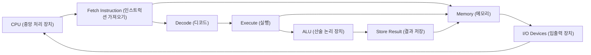
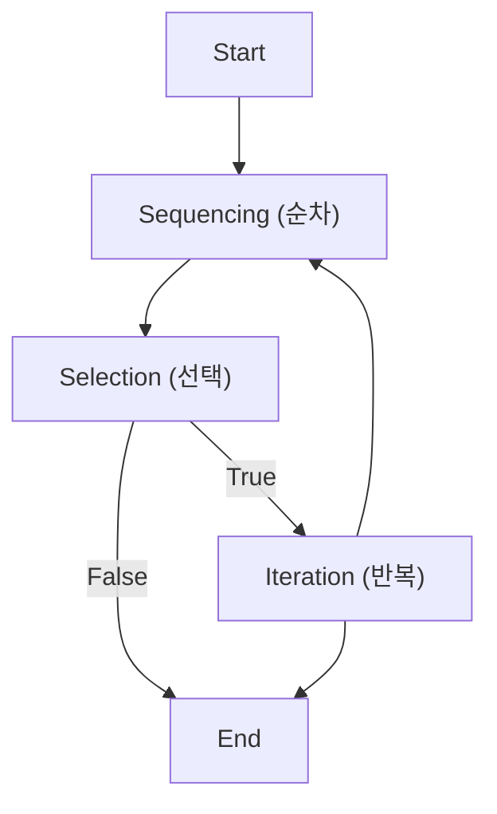

# Intermediate — Computer Science Foundations (컴퓨터 과학 기초)

> This tier explains **how** we turn a discovered problem into an algorithm, how that algorithm is expressed with basic control structures, and how computers — from early vacuum‑tube machines to modern mobile devices — execute those instructions using binary data and the von Neumann architecture.

---

## Worked Example (풀이 예제)

**Problem:** Compute the factorial of 5 ( 5! ) using an algorithm that explicitly shows **sequence** (순차), **condition** (조건), and **repetition** (반복).

### Step‑by‑step solution  

| Step | Action (English / Korean) | Explanation |
|------|---------------------------|-------------|
| 1 | **Initialize** (초기화) `result ← 1` | Sets the accumulator for the product. |
| 2 | **Initialize** (초기화) `i ← 1` | Counter starts at the first integer. |
| 3 | **Condition** (조건): `i ≤ 5` ? | Checks whether the loop should continue. |
| 4 | **If true**, **sequence** (순차): `result ← result × i` | Multiply the current result by the counter. |
| 5 | **Sequence** (순차): `i ← i + 1` | Increment the counter. |
| 6 | **Repeat** (반복) step 3 | Go back to the condition test. |
| 7 | **When condition false** (`i = 6`), **exit loop** (조건) | Loop ends; `result` now holds 5! = 120. |
| 8 | **Output** (출력) `result` | The algorithm returns 120. |

**Result:** `result = 120`, which is the factorial of 5.

*Key observations*  

- The **sequence** part is the straight‑line execution of statements (steps 1, 2, 4, 5, 8).  
- The **condition** controls whether the loop continues (steps 3, 7).  
- The **repetition** is the loop that cycles back to the condition (step 6).  

This tiny algorithm illustrates the three fundamental control structures that appear in every larger program.

---

## Core Ideas

### 1. Problem Discovery → Algorithmic Solution (문제 발견 → 알고리즘식 문제해결)

1. **Identify a real‑world question** (e.g., “How many ways can I arrange these books?”).  
2. **Formulate it as a computational problem** (define inputs, desired output).  
3. **Design an algorithm** (알고리즘) – a finite, ordered set of instructions that transforms the input into the output.

### 2. Algorithm Structure: Condition (조건), Repetition (반복), Sequence (순차)

| Structure | Role in an algorithm |
|-----------|----------------------|
| **Condition** (조건) | Branches execution: *if*‑*else* decisions. |
| **Repetition** (반복) | Loops: *while*, *for*, or *repeat‑until* to handle repeated work. |
| **Sequence** (순차) | Straight‑line execution of statements, one after another. |

These three constructs are **functionally complete**: any computable process can be expressed by nesting them.

### 3. Information Processing & Binary Number System (정보처리, 이진법)

- **Binary number system** (이진법) uses only two digits, 0 and 1.  
- All data—numbers, characters, images—are ultimately represented as **binary strings**.  
- Example conversion (decimal 156 → binary):  

  1. 156 ÷ 2 = 78 r 0 → LSB 0  
  2. 78 ÷ 2 = 39 r 0 → next 0  
  3. 39 ÷ 2 = 19 r 1 → next 1  
  4. 19 ÷ 2 = 9 r 1 → next 1  
  5. 9 ÷ 2 = 4 r 1 → next 1  
  6. 4 ÷ 2 = 2 r 0 → next 0  
  7. 2 ÷ 2 = 1 r 0 → next 0  
  8. 1 ÷ 2 = 0 r 1 → MSB 1  

  Reading remainders backward gives **10011100₂**.

### 4. Von Neumann Architecture (폰노이만 구조)

- **Stored‑program concept**: program instructions and data reside in the same memory.  
- Core components:  

  1. **Memory** – holds both data and instructions (address + value).  
  2. **Control Unit** – fetches an **instruction** (인스트럭션), decodes it, and issues control signals.  
  3. **Arithmetic‑Logic Unit (ALU)** – performs computations.  
  4. **Input/Output (I/O)** – communicates with the external world.  

- Execution proceeds in **machine cycles** (기계 주기): *fetch → decode → execute → store*.



### 5. Generations of Computing (컴퓨팅 세대)

| Generation | Dominant Technology (한국어) | Representative Example (예시) |
|------------|-----------------------------|------------------------------|
| **1st** (제1세대) | **Vacuum tubes** (진공관) | ENIAC |
| **2nd** (제2세대) | **Transistors** (트랜지스터) | IBM 1401 |
| **3rd** (제3세대) | **Integrated circuits** (집적회로) | IBM System/360 |
| **4th** (제4세대) | **Microcomputers** (마이크로 컴퓨터) → **Mobile** (모바일) | Apple Macintosh, smartphones |
| **5th** (제5세대) | **Artificial intelligence & parallelism** (인공지능, 병렬 처리) | Modern GPUs, quantum‑inspired processors |

Each generation reduced **size**, **cost**, and **power consumption**, while increasing **speed** and **functionality**.

### 6. Program (프로그램), Memory (메모리), Instruction (인스트럭션), Machine Cycle (기계 주기), Address (주소)

- **Program** (프로그램): a stored sequence of instructions that the CPU executes.  
- **Instruction** (인스트럭션): a binary‑encoded command (e.g., `ADD R1, R2`).  
- **Address** (주소): a binary identifier locating a memory cell.  
- **Machine cycle** (기계 주기): the repeating steps the CPU performs for each instruction (fetch‑decode‑execute‑store).  
- **Memory** (메모리): organized as an array of addressable locations; each location holds a binary **word** (data or instruction).

The **interaction** among these elements is what makes a computer *process information*.

---

## Key Terms (핵심 용어)

- **Algorithm** (알고리즘) — a finite, ordered set of instructions for solving a problem.  
- **Condition** (조건) — a Boolean test that determines which path of execution to follow.  
- **Repetition** (반복) — a loop that repeats a block of instructions while a condition holds.  
- **Sequence** (순차) — straight‑line execution of statements without branching.  
- **Binary number system** (이진법) — numeric representation using only 0 and 1.  
- **Von Neumann architecture** (폰노이만 구조) — computer design where program and data share the same memory.  
- **Instruction** (인스트럭션) — a binary‑encoded command for the CPU.  
- **Machine cycle** (기계 주기) — the fetch‑decode‑execute‑store loop performed for each instruction.  
- **Address** (주소) — a binary identifier for a memory location.  
- **Vacuum tube** (진공관) — early electronic switch used in 1st‑generation computers.  
- **Transistor** (트랜지스터) — semiconductor switch that replaced vacuum tubes in 2nd‑generation computers.  
- **Integrated circuit** (집적회로) — a chip containing many transistors, key to 3rd‑generation computers.  
- **Microcomputer** (마이크로 컴퓨터) — a computer built around a single integrated‑circuit CPU; foundation of 4th‑generation devices.  
- **Mobile** (모바일) — portable computing devices (smartphones, tablets) that evolved from microcomputers.  
- **Program** (프로그램) — stored instructions that the CPU executes.  
- **Memory** (메모리) — hardware that stores data and instructions, addressed by binary addresses.  

---

## Self-Check Prompts

1. Explain how the three control structures (condition, repetition, sequence) combine to form any algorithm.  
2. Convert the decimal number 156 to binary, showing each division step.  
3. Describe the four steps of a machine cycle and identify which component performs each step.  
4. List the dominant hardware technology for each of the five generations of computing and give one historical example per generation.

---

# Intermediate — Foundations of Computer Science (컴퓨터 과학 기초)

> This tier walks through how we turn real‑world problems into step‑by‑step algorithms, programs, and the low‑level machine actions that execute them.

## Worked Example (풀이 예제)

**Problem:**  
A small bakery wants to know how many total cookies it will have baked after **N** days if it bakes **20** cookies each day.

We will solve the problem using the full pipeline described in the slides:

| Stage | What we do | Result |
|-------|------------|--------|
| **1. Problem Finding & Shaping** | Identify the essential quantities: daily production (20) and number of days (N). Simplify: total = 20 × N. | A clear mathematical expression. |
| **2. Generate & Evaluate Solutions** | • *Formula* approach → total = 20 × N.<br>• *Loop* approach → add 20 repeatedly N times.<br>Choose the formula because it is O(1) time. | Selected solution: **total = 20 × N**. |
| **3. Algorithm Design** | Write a finite, definite, effectively computable procedure.<br>```\nAlgorithm TotalCookies(N)\n1. result ← 20 * N   // multiplication step\n2. return result\n``` | An algorithm with **sequencing** (step 1 → step 2) and **finiteness** (exactly two steps). |
| **4. Program (Pseudo‑code)** | Translate algorithm into a language the computer can store.<br>```\nint totalCookies(int N) {\n    return 20 * N; // single instruction\n}\n``` | A program – an unambiguous ordered sequence of instructions stored in memory. |
| **5. Machine Cycle (Fetch‑Decode‑Execute)** | For the statement `return 20 * N;` the CPU performs:<br>1. **Fetch** – control unit reads the machine‑code instruction from memory address pointed by the program counter.<br>2. **Decode** – instruction register separates opcode (multiply‑and‑store) and operands (20, N).<br>3. **Execute** – ALU multiplies 20 by N, stores result in a register, then the program counter increments to the next instruction (or returns). | The abstract instruction becomes concrete hardware actions. |
| **6. Verification** | Run the program with N = 5 → expected 100. The CPU cycles produce 100, confirming correctness. | Solution implemented and verified. |

Through this example we have exercised **problem‑solving techniques**, built an **algorithm** (with its properties), written a **program**, and traced the **machine cycle** that actually carries out the computation.

---

## Core Ideas

### 1. Computer Science (컴퓨터 과학) Overview
Computer science studies **computers and computing**: theoretical foundations, algorithms, data structures, hardware, software, and their use for processing information. It is an academic discipline distinct from merely writing code.

### 2. Problem‑Solving Techniques (문제 해결 기법)
1. **Problem Finding & Shaping** – Discover the problem and simplify it.  
2. **Generate & Evaluate Solutions** – Propose multiple approaches, compare (e.g., formula vs. loop).  
3. **Select, Implement, Verify** – Choose the best solution, turn it into an algorithm/program, then test it.  
The process is guided by **problem orientation** (coping style, skills) and systematic analysis.

### 3. Algorithms (알고리즘)
An algorithm is a **finite sequence of well‑defined instructions** that solves a class of problems.

#### Essential Properties
- **Finiteness (유한성)** – Must terminate after a limited number of steps.  
- **Definiteness (명확성)** – Every step is precisely specified.  
- **Effective Computability (효율적 계산 가능성)** – Each step can be performed by a computer.

#### Structural Building Blocks
| Construct | Description | Example |
|-----------|-------------|---------|
| **Sequencing (순차)** | Execute steps in a fixed order. | Step 1 → Step 2 → Step 3 |
| **Selection (선택)** | Choose a path based on a Boolean condition (if‑else). | `if (x > 0) … else …` |
| **Iteration (반복)** | Repeat steps a set number of times or until a condition holds (loops). | `while (i < n) { … i++ }` |



### 4. Programs (프로그램)
A program is a **detailed, unambiguous plan** stored in a computer’s memory that the CPU can execute. Programs consist of ordered instructions derived from an algorithm. The concept of an internally stored program dates back to **John von Neumann** (late 1940s).

### 5. Memory (메모리) & Instructions (명령)
- **Memory** is the primary storage area that holds data and the program’s instructions, supplying the CPU as needed.  
- An **instruction** is a single operation defined by the processor’s instruction set; it tells the CPU *what* to do.

### 6. Machine Cycle (기계 사이클)
The **machine cycle** (or instruction cycle) is the repeatable three‑step process the CPU performs for each instruction:

1. **Fetch (페치)** – Control unit reads the instruction from memory at the address in the **program counter**.  
2. **Decode (디코드)** – Instruction register parses the opcode and operand fields.  
3. **Execute (실행)** – CPU carries out the operation (e.g., arithmetic, memory access).  

Some textbooks add a fourth **Store** step when the result is written back to memory.


The cycle repeats millions of times per second, enabling programs to run.

---

## Key Terms (핵심 용어)

- **Computer science (컴퓨터 과학)** — The study of computers, algorithms, hardware, software, and information processing.  
- **Problem‑solving technique (문제 해결 기법)** — Structured approach to identify, generate, evaluate, and implement solutions.  
- **Algorithm (알고리즘)** — Finite, definite, effectively computable sequence of instructions.  
- **Sequencing (순차)** — Ordered execution of steps.  
- **Selection (선택)** — Conditional branching based on Boolean expressions.  
- **Iteration (반복)** — Repeating a set of steps until a condition is met.  
- **Program (프로그램)** — Stored, unambiguous instruction sequence that implements an algorithm.  
- **Memory (메모리)** — Primary storage for data and program instructions.  
- **Instruction (명령)** — Single operation defined by the processor’s instruction set.  
- **Machine cycle (기계 사이클)** — The fetch‑decode‑execute (and optionally store) loop performed by the CPU for each instruction.  

---

## Self‑Check Prompts

1. **Explain** how the three properties of an algorithm (finiteness, definiteness, effective computability) guarantee that a computer can finish a task.  
2. **Describe** the three structural constructs of algorithms (sequencing, selection, iteration) and give a real‑world example for each.  
3. **Outline** the steps of the machine cycle and indicate what hardware component is primarily responsible for each step.  
4. **Compare** the roles of a *program* and *memory* in executing a solution to a problem.
