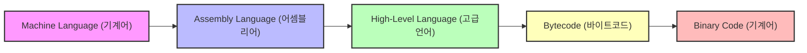
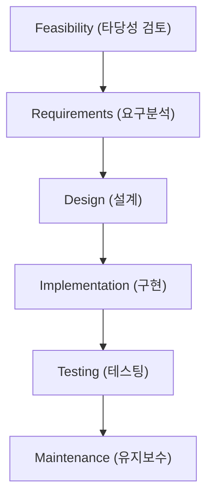

# Advanced — Programming Languages and Software Development (프로그래밍 언어와 소프트웨어 개발)

> This tier dives into the hardware‑level mechanics, compilation pipelines, and deeper paradigms behind the programming languages and software‑development processes introduced in the lecture deck.

## Worked Example (풀이 예제)

**Problem:**  
Translate the following simple high‑level C program into (1) assembly language using an assembler, and (2) the final 16‑bit machine code shown in the slide’s “virtual machine code” table. Show each translation step and explain how the compiler, assembler, and linker contribute.

```c
int main(void) {
    int a = 10;          // store constant 10 in variable a
    int b = 6;           // store constant 6 in variable b
    int sum = a + b;     // add and store result in sum
    return sum;          // exit with sum as status code
}
```

### Step 1 – Source → Intermediate Representation (IR)

A typical compiler front‑end parses the source and builds an abstract syntax tree (AST). For this tiny program the IR might look like:

```
DECLARE a = 10
DECLARE b = 6
DECLARE sum
sum = ADD a, b
RETURN sum
```

### Step 2 – IR → Assembly (using an **assembler** (어셈블러))

Assume a simple 16‑bit instruction set similar to the “virtual assembly” shown on slide 8.

| Assembly mnemonic | Operands | Meaning |
|-------------------|----------|---------|
| `LOD`              | `TEN`    | Load constant 10 into accumulator |
| `ADD`              | `SIX`    | Add constant 6 |
| `STO`              | `SUM`    | Store result in variable `SUM` |
| `RET`              | –        | Return (value in accumulator becomes exit code) |

Corresponding assembly source (pseudo‑syntax, Korean comments removed):

```asm
        LOD   TEN        ; load 10
        ADD   SIX        ; add 6 → accumulator = 16
        STO   SUM        ; store 16 into SUM
        RET              ; return SUM as exit status
TEN:    DATA  10
SIX:    DATA   6
SUM:    DATA   0
```

### Step 3 – Assembly → Machine Code (using the **assembler** (어셈블러))

The assembler translates each mnemonic into the 16‑bit binary patterns listed on slide 8.

| Assembly | Binary (16 bit) |
|----------|-----------------|
| `LOD TEN`| `1010101010111100` |
| `ADD SIX`| `1001010111100010` |
| `STO SUM`| `1010111100001010` |
| `DATA 10`| `0000000000001010` |
| `DATA 6` | `0000000000000110` |
| `DATA 0` | `0000000000000000` |

Thus the final machine‑code image (in order of execution) is:

```
1010101010111100 1001010111100010 1010111100001010
0000000000001010 0000000000000110 0000000000000000
```

### Step 4 – Linking & Loading (optional for this single‑module program)

A linker would place the code segment into memory, resolve the symbolic addresses (`TEN`, `SIX`, `SUM`), and produce an executable image. The loader then copies this image into RAM and transfers control to the first instruction.

**Result:**  
The program, when run on the hypothetical 16‑bit virtual CPU, returns the value **16** (10 + 6) as its exit status, demonstrating the full path **Source Code → Assembly → Machine Code** as described in the lecture’s compilation diagram.

---

## Core Ideas

### 1. Evolution of Programming Languages (프로그래밍 언어의 변화)

- **Machine language (기계어)** – the raw binary instruction set directly understood by the CPU.  
- **Assembly language (어셈블리어)** – a symbolic, mnemonic representation of machine instructions; translated by an **assembler (어셈블러)**.  
- **High‑level language (고급언어)** – abstracted syntax independent of any specific hardware; translated by a **compiler (컴파일러)** into machine code or intermediate bytecode.  

The timeline (slide 4) shows four generations:

| Generation | Typical Language | Key Feature |
|------------|------------------|-------------|
| 1st (1940s) | Machine code | Direct hardware control |
| 2nd (1950s) | Assembly | Symbolic mnemonics |
| 3rd (1960s‑1970s) | FORTRAN, COBOL, C | Structured, portable |
| 4th (1980s‑present) | Java, Python, SQL, HTML | Platform‑independent, rich libraries |



### 2. Low‑Level Translation Mechanics

- **Assembler (어셈블러)** reads symbolic opcodes (e.g., `LOD`, `ADD`) and resolves **labels** (`TEN`, `SIX`) to concrete addresses, emitting the 16‑bit patterns shown on slide 8.  
- **Compiler (컴파일러)** performs lexical analysis, parsing, semantic checking, optimization, and code generation. The output can be:
  - Direct **machine code** (C → binary) or  
  - **Intermediate bytecode (바이트코드)** (Java source → `.class` files) which the **Java Virtual Machine (JVM) (자바가상기계)** later interprets or JIT‑compiles to binary.

### 3. Procedural Programming (절차적언어)

- Emphasizes **structured programming**: sequential execution, selection, and iteration.  
- Core construct: **functions (함수)** – also called **subroutines**, **methods**, or **procedures (프로시저)**.  
- Representative languages (slide 13): **FORTRAN**, **COBOL**, **Pascal**, **C**.  
- Example (FORTRAN‑style) on slide 14 computes a circle’s area using a simple sequential flow.

### 4. Object‑Oriented Programming (객체지향프로그래밍언어)

- **Object (객체)** = encapsulated **attributes (속성)** + **methods (메소드)**.  
- **Message passing** – objects invoke each other’s methods.  
- **Class (클래스)** defines a blueprint; **class inheritance (클래스상속)** enables reuse and polymorphism.  
- Rich **libraries (라이브러리)** provide pre‑built objects.  

```mermaid
classDiagram
    class Object {
        <<abstract>>
        +attributes
        +methods
    }
    class Class {
        +inherit()
        +instantiate()
    }
    Object <|-- Class
    Class <|-- "C++"
    Class <|-- "Java"
    Class <|-- "Python"
```

- Languages: **C++**, **Java**, **Python**, **C#**, **Ada** (slides 16‑20).  
- Java’s compilation pipeline (slide 19): Source → **Bytecode (바이트코드)** → **JVM (자바가상기계)** → **Binary Code (기계어)**.

### 5. Special‑Purpose Languages (특수목적언어)

- Often **non‑procedural** and **script**‑oriented (4th‑generation).  
- **SQL (SQL)** – declarative queries for relational databases.  
- **HTML (HTML)** – markup language describing document structure.  
- **JavaScript (자바스크립트)** – client‑side scripting; differs from Java despite the similar name.  

The browser workflow (slide 22) shows how a URL is resolved, the HTML file fetched, parsed, and rendered.

### 6. Interpreters (인터프리터) vs. Compilers

- **Interpreter (인터프리터)** translates source line‑by‑line at runtime, executing immediately without producing a standalone executable.  
- Typically slower than compiled code but enables rapid development and platform independence.  
- Script languages (LISP, BASIC, PERL, HTML, JavaScript) often use interpreters (slide 24).

### 7. Paradigm‑Specific Languages

| Paradigm | Representative Language | Korean term |
|----------|--------------------------|-------------|
| Functional | LISP | 함수형 언어 |
| Logical   | Prolog | 논리형 언어 |
| Parallel  | (Various, e.g., OpenMP, MPI) | 병렬 프로그래밍언어 |

These languages differ in **execution model** (e.g., immutable data in functional, backtracking in logical, concurrency primitives in parallel).

### 8. Software Development Process (소프트웨어 개발 과정)

1. **Feasibility study (타당성 검토)** – assess project viability.  
2. **Requirements analysis (요구분석)** – produce a **specification (명세서)**.  
3. **Design (설계)** – architectural and detailed design, selection of algorithms.  
4. **Implementation (구현)** – **coding (코딩)**, often reusing existing **libraries (라이브러리)**; experience accumulates over time (slide 29).  
5. **Testing (테스팅)** – unit, integration, system tests; includes **benchmarking**.  
6. **Maintenance (유지보수)** – bug fixes, updates, documentation.

Analogy with house construction (slide 28) maps each software phase to a construction step (site selection → design → building → warranty).



### 9. Supporting Tools & Process Models

- **CASE (Computer Aided Software Engineering) (CASE)** – automated analysis, design, and documentation tools.  
- **IDE (Integrated Development Environment) (IDE)** – combines editor, compiler, debugger, and build automation.  
- **Process models**: **Waterfall model (워터폴 모델)** – linear, phase‑gated; **Incremental model (증분 모델)** – delivers functional increments iteratively (slide 32).

---

## Key Terms (핵심 용어)

- **Machine language (기계어)** — binary instruction set directly executed by the CPU.  
- **Assembly language (어셈블리어)** — symbolic representation of machine instructions.  
- **Assembler (어셈블러)** — program that translates assembly to machine code.  
- **High‑level language (고급언어)** — abstract programming language independent of hardware.  
- **Compiler (컴파일러)** — translates high‑level source to machine code or bytecode.  
- **Procedural language (절차적언어)** — language emphasizing procedures/functions and structured flow.  
- **Function (함수)** — reusable block of code; may be called subroutine, method, or procedure.  
- **Object (객체)** — encapsulated data + behavior.  
- **Attribute (속성)** — variable belonging to an object.  
- **Method (메소드)** — function belonging to an object.  
- **Class (클래스)** — blueprint for objects; supports inheritance (클래스상속).  
- **Library (라이브러리)** — collection of pre‑written code for reuse.  
- **Bytecode (바이트코드)** — intermediate, platform‑independent code (e.g., Java).  
- **JVM (자바가상기계)** — virtual machine that executes Java bytecode.  
- **Special‑purpose language (특수목적언어)** — language designed for a narrow domain (SQL, HTML, JavaScript).  
- **Script language (스크립트 언어)** — interpreted language for automation or web tasks.  
- **Interpreter (인터프리터)** — executes source code directly without producing a separate binary.  
- **Functional language (함수형 언어)** — emphasizes immutable data and first‑class functions (LISP).  
- **Logical language (논리형 언어)** — based on formal logic and backtracking (Prolog).  
- **Parallel programming language (병렬 프로그래밍언어)** — supports concurrent execution across multiple processors.  
- **Software development process (소프트웨어 개발 과정)** — organized set of activities from feasibility to maintenance.  
- **CASE (CASE)** — tools that assist in software engineering tasks.  
- **IDE (IDE)** — integrated environment for coding, building, and debugging.  
- **Waterfall model (워터폴 모델)** — sequential development methodology.  
- **Incremental model (증분 모델)** — iterative delivery of functional increments.

---

## Self‑Check Prompts

1. Explain the full translation pipeline from a high‑level C program to the 16‑bit machine code shown on slide 8, naming each tool (compiler, assembler, linker) and its role.  
2. Contrast procedural and object‑oriented paradigms in terms of code organization, reuse mechanisms, and typical language examples.  
3. Describe how a Java program is executed on a modern system, detailing the steps from source code to binary execution.  
4. Identify three special‑purpose languages from the deck, stating their primary domain and whether they are compiled or interpreted.
