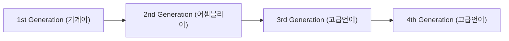
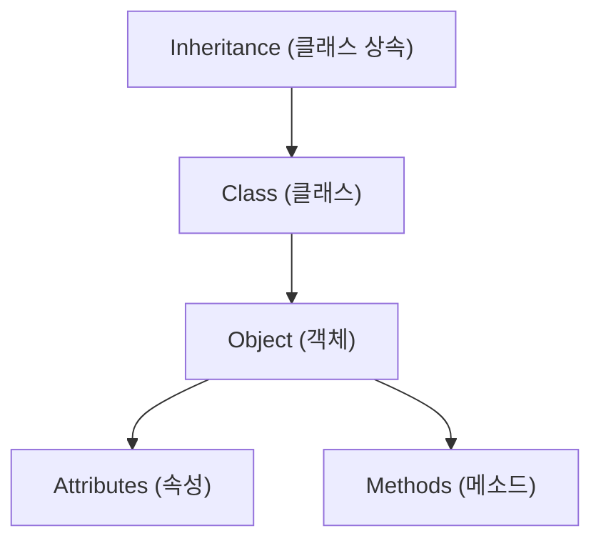
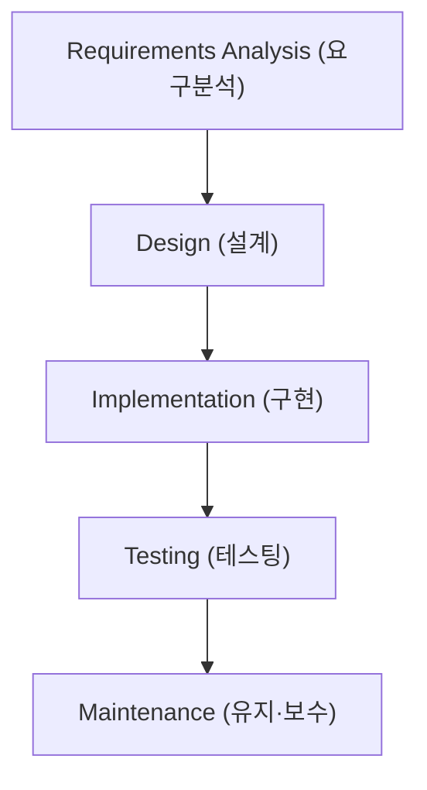
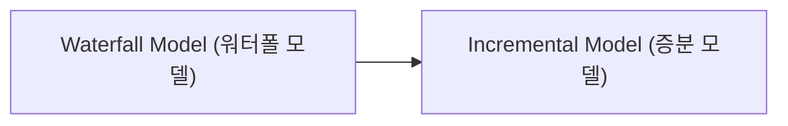

# Beginner — Programming Languages and Software Development (프로그래밍 언어와 소프트웨어 개발)

> This tier introduces the families of programming languages, how they are translated into something a computer can run, and the basic steps and roles involved in building software.

## Worked Example (풀이 예제)

**Problem:** Write a tiny program that adds two integers, compile it, and see how the source code becomes machine‑level instructions.

1. **Write the source (high‑level language).**  
   ```c
   /* add.c */
   #include <stdio.h>

   int main(void) {
       int a = 5;
       int b = 7;
       int sum = a + b;
       printf("Sum = %d\n", sum);
       return 0;
   }
   ```

2. **Run the compiler** (e.g., `gcc add.c -o add`).  
   The compiler translates the *source code* (source code (원시코드)) into an *object file* containing **machine language** (machine language (기계어)) instructions.

3. **Inspect the generated assembly (optional).**  
   ```bash
   gcc -S add.c   # produces add.s
   ```
   The assembly file shows symbolic instructions such as `mov`, `add`, `call`, which the **assembler** (assembler (어셈블러)) would later turn into binary op‑codes.

4. **Look at the binary (machine code).**  
   ```bash
   objdump -d add   # disassembles the executable
   ```
   You will see lines like `0x08048430:  b8 0c 00 00 00    mov    $0xc,%eax` – the actual 0/1 patterns the CPU executes.

5. **Run the program.**  
   ```bash
   ./add
   ```
   Output: `Sum = 12`

**What happened?**  

- The **high‑level language** (C) let us write readable statements.  
- The **compiler** (compiler (컴파일러)) turned those statements into **machine code** (machine code (기계어)) that the CPU understands.  
- The operating system loads the binary into memory and the CPU executes the 0/1 instructions, producing the printed result.

---

## Core Ideas

### 1. Evolution of Programming Languages (프로그래밍 언어의 변화)

| Generation | Typical Language | Note |
|------------|------------------|------|
| 1st generation (1세대) | Machine language (machine language (기계어)) | hardware‑dependent |
| 2nd generation (2세대) | Assembly language (assembly language (어셈블리어)) | symbolic mnemonics |
| 3rd generation (3세대) | High‑level language (high‑level language (고급언어)) | procedural focus |
| 4th generation (4세대) | High‑level language (high‑level language (고급언어)) | object‑oriented, scripting, domain‑specific |

These generations show a trend from **hardware‑dependent** code toward **human‑friendly, portable** code.



### 2. Low‑Level Languages

- **Machine language (machine language (기계어))** – Direct 0/1 patterns the CPU executes; *dependent on computer system*.  
- **Assembly language (assembly language (어셈블리어))** – Uses **symbols** (mnemonics) like `MOV`, `ADD` to represent machine instructions; an **assembler** (assembler (어셈블러)) converts them to binary.

> Example (virtual assembly → machine code)  
> ```
> LOD TEN   → 1010101010111100
> ADD SIX   → 1001010111100010
> STO A     → 1010111100001010
> ```

### 3. High‑Level Languages (high‑level language (고급언어))

- Written in **source code** (source code (원시코드)) that is **independent of computer systems**.  
- A **compiler** (compiler (컴파일러)) translates the whole program to **binary code** (binary code (기계어)) before execution.

### 4. Types of High‑Level Languages

| Category | Typical Languages |
|----------|-------------------|
| Procedural language (절차적 언어) | FORTRAN, COBOL, Pascal, C |
| Object‑oriented language (객체지향 언어) | C++, Java, Python, C#, Ada |
| Special‑purpose language (특수목적 언어) | SQL, HTML, JavaScript |
| Other paradigms (기타 패러다임) | Functional (LISP), Logical (Prolog), Parallel |

#### 4.1 Procedural Languages (procedural language (절차적 언어))

- Emphasize **structured** (structured (구조화)) code with **sequential execution** and **subroutines** (functions, procedures).  
- Example: a simple **FORTRAN** program that computes a circle’s area.

```fortran
program circle
  real r, area
  write (*,*) 'Give radius r:'
  read (*,*) r
  area = 3.14159 * r * r
  write (*,*) 'Area = ', area
  stop
end
```

#### 4.2 Object‑Oriented Languages (object‑oriented language (객체지향 언어))

- **Object (객체)** – bundle of **attributes** (attributes (속성)) and **methods** (methods (메소드)).  
- **Message** passing triggers method execution.  
- **Class (클래스)** defines a blueprint; **inheritance** (inheritance (클래스 상속)) lets new classes reuse existing ones.  
- Rich **libraries** (libraries (라이브러리)) promote code reuse.



#### 4.3 Special‑Purpose Languages (special‑purpose language (특수목적 언어))

- Often **non‑procedural** and called **script language** (script language (스크립트 언어)).  
- **SQL (SQL)** – queries databases.  
- **HTML (HTML)** – marks up web documents.  
- **JavaScript (JavaScript (자바스크립트))** – adds interactivity to web pages (different from Java).

### 5. Interpreters vs. Compilers (interpreter (인터프리터) vs. compiler (컴파일러))

- **Interpreter (interpreter (인터프리터))** reads source code and executes it **line‑by‑line** without producing a standalone executable; generally slower.  
- Used for many script languages: **LISP, BASIC, PERL, HTML, JavaScript**.

### 6. Other Programming Paradigms (기타 프로그래밍 패러다임)

- **Functional language (functional language (함수형 언어))** – e.g., **LISP** focuses on evaluating functions.  
- **Logical language (logical language (논리형 언어))** – e.g., **Prolog** uses facts and rules.  
- **Parallel language (parallel language (병렬 언어))** – designed for concurrent execution.

### 7. Software Development Process (software development process (소프트웨어 개발 과정))

1. **Pre‑implementation** (pre‑implementation (구현 전 단계))  
   - Feasibility study (feasibility study (타당성 검토))  
   - Requirements analysis & specification (requirements analysis (문제 분석) & specification (명세서))  
   - Design (design (설계))  
   - Algorithm selection & analysis (algorithm selection (알고리즘 선택) & analysis (분석))

2. **Implementation** (implementation (구현))  
   - Coding (coding (코딩))  
   - Debugging (debugging (디버깅))

3. **Post‑implementation** (post‑implementation (구현 후 단계))  
   - Testing, AS, benchmarking (testing (테스팅), AS, benchmarking (벤치마킹))  
   - Documentation (documentation (문서 작업))  
   - Maintenance & support (maintenance (유지·보수))



*Analogy:* building a house → **site selection → blueprint → construction → inspection → upkeep**.

### 8. Roles in Software Projects (software project roles (소프트웨어 프로젝트 역할))

- **System Engineer (system engineer (시스템 엔지니어))**  
- **Software Engineer (software engineer (소프트웨어 엔지니어))**  
- **Programmer (programmer (프로그래머))**  
- **Tester (tester (테스터))**  
- **Maintainer (maintainer (유지보수자))**

### 9. Tool Support (tool support (도구 지원))

- **CASE (CASE (컴퓨터지원소프트웨어공학도구))** – assists with design and documentation.  
- **IDE (IDE (통합개발환경))** – combines editing, compiling, and debugging.

### 10. Development Models (development models (개발 모델))

- **Waterfall model (Waterfall model (워터폴 모델))** – linear, phase‑by‑phase progression.  
- **Incremental model (Incremental model (증분 모델))** – builds the system in small, usable increments.



---

## Key Terms (핵심 용어)

- **Machine language (기계어)** — Binary instructions the CPU executes directly.  
- **Assembly language (어셈블리어)** — Symbolic representation of machine instructions; translated by an **assembler (assembler (어셈블러))**.  
- **High‑level language (고급언어)** — Human‑readable code independent of hardware; compiled by a **compiler (compiler (컴파일러))**.  
- **Procedural language (절차적 언어)** — Emphasizes sequences of statements and subroutines.  
- **Object‑oriented language (객체지향 언어)** — Organizes code around objects, classes, and inheritance.  
- **Script language (스크립트 언어)** — Interpreted language used for quick tasks; often non‑procedural.  
- **Interpreter (인터프리터)** — Executes source code directly without producing a separate executable.  
- **Functional language (함수형 언어)** — Treats computation as evaluation of mathematical functions.  
- **Logical language (논리형 언어)** — Uses logical statements and inference (e.g., Prolog).  
- **IDE (통합개발환경)** — Software that integrates editing, building, and debugging tools.  
- **CASE (컴퓨터지원소프트웨어공학도구)** — Tools that assist in software design and documentation.  
- **Waterfall model (워터폴 모델)** — Sequential software development lifecycle.  
- **Incremental model (증분 모델)** — Develops software in repeated cycles, adding functionality each time.

---

## Self-Check Prompts

1. **What are the main differences between machine language, assembly language, and high‑level language?**  
2. **Name two procedural languages and two object‑oriented languages introduced in the slides.**  
3. **Explain how a compiler and an interpreter each turn source code into actions performed by the computer.**  
4. **Outline the three major phases of the software development process and give one activity that belongs to each phase.**
