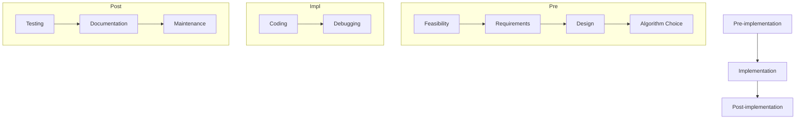

# Intermediate — Programming Languages and Software Development (프로그래밍 언어와 소프트웨어 개발)

> This tier explains **how** programming languages are transformed, organized, and applied throughout the software development life‑cycle, with concrete step‑by‑step examples.

## Worked Example (풀이 예제)

**Problem:**  
You are given the following high‑level C program that computes the power \(2^{10}\) using the `pow` function from `<math.h>`.

```c
#include <stdio.h>
#include <math.h>

int main(void) {
    double result = pow(2.0, 10.0);
    printf("2^10 = %.0f\n", result);
    return 0;
}
```

**Task:**  
Show the complete transformation from **source code** → **compiler** → **object code** → **executable** and indicate where the **interpreter** would differ if the same program were written in a scripting language such as Python.

### Step‑by‑Step Solution  

1. **Source Code (원시코드)**
   - The text you write in the editor is the *source code* written in a high‑level language (C).

2. **Lexical & Syntax Analysis**
   - The **compiler** scans the source, tokenises keywords (`#include`, `int`, `return`), identifiers (`result`, `pow`), literals (`2.0`, `10.0`), and operators (`=` , `;`).

3. **Semantic Analysis**
   - The compiler checks that `pow` is declared in `<math.h>`, that the arguments are of type `double`, and that `printf`’s format matches the argument type.

4. **Intermediate Representation (IR) Generation**
   - The compiler creates an intermediate, machine‑independent representation (e.g., three‑address code):
     ```
     t1 = 2.0
     t2 = 10.0
     t3 = pow(t1, t2)
     result = t3
     call printf("2^10 = %.0f\n", result)
     ```

5. **Optimization (optional)**
   - The IR may be optimized (constant folding: `pow(2.0,10.0)` → `1024.0`).

6. **Code Generation**
   - The compiler translates the IR into **assembly language** for the target CPU (e.g., x86‑64):
     ```
     movsd xmm0, QWORD PTR [const_2]
     movsd xmm1, QWORD PTR [const_10]
     call pow
     movsd QWORD PTR [result], xmm0
     lea rdi, [fmt_str]
     movsd xmm0, QWORD PTR [result]
     call printf
     ```

7. **Assembly → Machine Code (기계어)**
   - An **assembler** converts each assembly instruction into a 16‑ or 32‑bit binary opcode (e.g., `1010101010111100`).

8. **Linking**
   - The **linker** combines the object file with library code (`libm` for `pow`, `libc` for `printf`) producing a single **executable** (binary code).

9. **Execution**
   - The operating system loads the executable into memory and the CPU runs the binary instructions directly.

---

**If the program were written in Python (an interpreted, script language):**

```python
import math
print("2^10 =", int(math.pow(2, 10)))
```

1. **Source Code** → **Interpreter** reads the script line by line.
2. The interpreter **parses** the code into an abstract syntax tree (AST) at runtime.
3. The AST is **executed immediately** by the Python virtual machine (bytecode interpreter). No separate executable file is produced; the interpreter translates each statement to bytecode on the fly and runs it.
4. Because the translation happens at run‑time, **execution speed** is generally slower than the compiled C version.

---

## Core Ideas

### 1. Evolution of Programming Languages (프로그래밍 언어의 변화)

| Generation | Typical Language | Key Characteristics |
|------------|------------------|----------------------|
| 1st (1세대) | **Machine language** (기계어) | Binary code (0/1) directly understood by hardware; *dependent on computer systems*. |
| 2nd (2세대) | **Assembly language** (어셈블리어) | Symbolic mnemonics; translated by an **assembler**; still hardware‑specific. |
| 3rd (3세대) | **High‑level language** (고급언어) – procedural, object‑oriented, etc. | Human‑readable syntax; **compiler** produces machine code; *independent of computer systems*. |
| 4th (4세대) | **Special‑purpose / scripting languages** (특수목적언어) | Non‑procedural, often interpreted; used for databases, web pages, etc. |


### 2. Low‑Level Languages  

- **Machine language (기계어)**  
  - Consists of binary numbers; the only language the CPU executes directly.  
  - Example: `1010101010111100` (16‑bit opcode).

- **Assembly language (어셈블리어)**  
  - Uses *symbols* (mnemonics) like `MOV`, `ADD`, `LOOP`.  
  - An **assembler** translates each mnemonic to its binary opcode.  
  - Example mapping (from slide):  

    | Symbolic Code | Machine Code (16‑bit) |
    |---------------|-----------------------|
    | `LOD TEN`    | `1010101010111100`    |
    | `ADD SIX`    | `1001010111100010`    |
    | `STO A`      | `1010111100001010`    |

### 3. High‑Level Languages (고급언어)

- **Procedural (절차적) languages** – emphasize **structured** programming with sequential execution and sub‑routines (functions, procedures).  
  - Examples: **FORTRAN**, **COBOL**, **Pascal**, **C**.  
  - Typical flow: *source → compiler → machine code*.

- **Object‑Oriented (객체지향) languages** – organize code around **objects** (state + behavior).  
  - Core concepts: **object (객체)**, **class (클래스)**, **inheritance (클래스상속)**, **method (메소드)**, **message (메시지)**.  
  - Example languages: **C++**, **Java**, **Python**, **C#**, **Ada**.  

```mermaid
classDiagram
    class Object {
        +attributes
        +methods()
    }
    class Class {
        +attributes
        +methods()
    }
    Object <|-- Class : "instance of"
    Class <|-- "Subclass" : "inherits"
```

- **Special‑purpose (특수목적) languages** – often **non‑procedural** and used for a narrow domain.  
  - **SQL** – database queries.  
  - **HTML** – markup for web pages.  
  - **JavaScript** – client‑side scripting; differs from Java (different runtime, no static typing).  

### 4. Interpreters vs. Compilers  

| Aspect | Compiler (컴파일러) | Interpreter (인터프리터) |
|--------|-------------------|--------------------------|
| Translation time | Whole program → machine code **before** execution | Translates **line‑by‑line** at run‑time |
| Output | Stand‑alone executable (binary) | No separate executable; runs inside the interpreter |
| Speed | Faster execution (once compiled) | Slower execution (translation overhead each run) |
| Example languages | C, C++, Java (bytecode stage) | Python, JavaScript, LISP, BASIC |

### 5. Paradigm‑Diverse Languages  

- **Functional (함수형) language** – treats computation as evaluation of mathematical functions; avoids mutable state. Example: **LISP**.  
- **Logical (논리형) language** – based on formal logic and rule inference. Example: **Prolog**.  
- **Parallel (병렬) programming languages** – provide constructs for concurrent execution (e.g., OpenMP, MPI).  

### 6. Software Development Process (소프트웨어 개발 과정)

1. **Pre‑implementation**  
   - Feasibility study, requirements analysis, specification, design, algorithm selection.  

2. **Implementation**  
   - **Coding** (writing source code).  
   - **Debugging** (finding and fixing defects).  

3. **Post‑implementation**  
   - Testing, maintenance, documentation, benchmarking, support.  



- **Waterfall model** – linear, phase‑by‑phase progression.  
- **Incremental model** – builds the system in small, functional increments.

### 7. Supporting Tools  

- **CASE (Computer Aided Software Engineering)** – tools for analysis, design, and documentation.  
- **IDE (Integrated Development Environment)** – combines editor, compiler/interpreter, debugger, and build automation (e.g., Eclipse, Visual Studio).  

## Key Terms (핵심 용어)

- **Machine language (기계어)** — Binary instructions directly executed by the CPU.  
- **Assembly language (어셈블리어)** — Symbolic representation of machine instructions; translated by an *assembler*.  
- **High‑level language (고급언어)** — Human‑readable programming language; compiled or interpreted into machine code.  
- **Compiler (컴파일러)** — Translates entire source code into machine code before execution.  
- **Assembler (어셈블러)** — Converts assembly language into machine language.  
- **Procedural language (절차적 언어)** — Emphasizes sequence, selection, iteration, and sub‑routines.  
- **Object (객체)** — Instance containing attributes (variables) and methods (functions).  
- **Class (클래스)** — Blueprint for creating objects; can inherit from other classes.  
- **Inheritance (클래스상속)** — Mechanism for a class to acquire properties of another class.  
- **Interpreter (인터프리터)** — Executes source code directly, translating on the fly.  
- **SQL (SQL)** — Structured Query Language for managing relational databases.  
- **HTML (HTML)** — HyperText Markup Language; defines the structure of web pages.  
- **JavaScript (자바스크립트)** — Scripting language for client‑side web interactivity.  
- **Functional language (함수형 언어)** — Focuses on pure functions and immutable data.  
- **Logical language (논리형 언어)** — Uses logical clauses and inference (e.g., Prolog).  
- **Parallel programming (병렬 프로그래밍)** — Writing programs that execute simultaneously on multiple processors.  
- **Software Development Life Cycle (SDLC, 소프트웨어 개발 과정)** — Structured phases from analysis to maintenance.  
- **Waterfall model (워터폴 모델)** — Sequential SDLC model.  
- **Incremental model (증분 모델)** — Builds software in repeated increments.  
- **CASE tool (CASE 도구)** — Software that assists in software engineering tasks.  
- **IDE (IDE)** — Integrated environment for coding, building, and debugging.

## Self-Check Prompts

1. **Transformation Path:** Explain, in order, how a C program becomes executable machine code, and contrast this with how a Python script runs.  
2. **Language Classification:** For each of the following languages, state whether it is procedural, object‑oriented, functional, logical, or special‑purpose: **FORTRAN, Java, SQL, LISP, Prolog.**  
3. **Compiler vs. Interpreter:** List three advantages and three disadvantages of using a compiler instead of an interpreter.  
4. **Software Process Mapping:** Match the following activities to the correct SDLC phase: (a) writing unit tests, (b) creating class diagrams, (c) performing a feasibility study, (d) debugging runtime errors.
